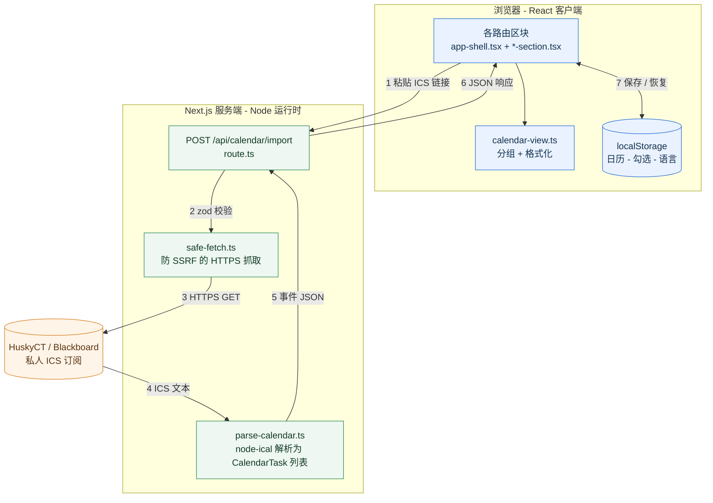

# BetterHuskyCT

**把你的课程 deadline 整理清楚。** 把任何 LMS 或日历应用的日历接进来——粘贴私人 ICS 链接，或者直接拖入下载好的 `.ics` 文件——得到一份清晰有序的「接下来要交什么」。

[English](./README.md) | **简体中文**

[**在线演示**](https://betterhuskyct.vercel.app/) · [更新日志](./CHANGELOG.md) · [反馈问题](https://github.com/NoGod3524/betterhuskyct/issues)

[](https://github.com/NoGod3524/betterhuskyct/actions/workflows/ci.yml)


## 界面截图

**总览** —— 添加日历，然后是滚动的本周视图。


**安排** —— 今天 / 明天 / 本周，可勾选完成。


英文界面：[`overview.png`](./public/screenshots/overview.png) · [`tasks.png`](./public/screenshots/tasks.png)

## 为什么做这个

学生的 deadline 散落在教学平台、课程大纲和邮件里。BetterHuskyCT 把你本来就有的日历订阅，变成一份滚动的未来 7 天任务清单——「接下来要交什么」一眼可见，不用到处翻。

它刻意做得小而注重隐私：不需要 NetID、不需要密码、不爬取网页、不需要注册账号。

BetterHuskyCT 是在 UConn 对着 HuskyCT（Blackboard）做的，而它恰好是最难搞的那一档：**一门课一条订阅**，而且作业条目完全不写课程名。除此之外，任何能导出 iCalendar 的系统都能用——见[去哪儿取你的日历](#去哪儿取你的日历)。

## 功能

- **导入任意 ICS 日历** —— 把下载好的 `.ics` 文件拖到页面任何位置，或者粘贴私人订阅链接；一次多个也行
- **自动填上课程号** —— Blackboard 的订阅只写「Environmental Science」不写课号，所以 App 会去 UConn 公开的课程目录里查，自己填上 `NRE 1000E`。不用任何配置
- **不用服务器就能同步到手机** —— 点「同步」把日历、勾选、课程，以及助手带回来的课程公告，压成一条链接（120 条 deadline + 40 条公告大约 3,100 字符）。它放在 URL 的 fragment 里，不会被上传；你的订阅链接**故意不包含在内**
- **多个日历、多门课** —— HuskyCT 是每门课一条订阅，你有几条就加几条；每条订阅归到一门课（课程代码 + LEC / DIS / LAB / SEM），任务行就会显示它属于哪门课、是「上课」还是「作业」、在哪个教室、精确到分钟的截止时间；默认不对的那条可以单独改
- **滚动 7 天视图** —— 今天 / 明天 / 本周，分组并按时间排序
- **到期提醒** —— 未来 24 小时有任务到期时显示横幅；可选开启浏览器通知（App 打开时生效）
- **可安装 + 离线** —— 作为 PWA 加到手机主屏幕，没网也能看已保存的任务
- **课程公告** —— 浏览器助手在送 deadline 的同一按里把课程公告一起带来，按课程分组、最新的在最前
- **公告总结** —— 选一门课，按一下就把它的公告浓缩成要点（截止日期、考试、调课停课），用你的界面语言，任何设备都能用。由 Z.ai 的免费 GLM 模型生成，GLM 忙时改用 Google Gemini 免费版，再忙改用 Groq；按下之前页面就写明每家分别会怎么处理这些内容，不按就什么都不发。按钮旁边的「模型」菜单可以把它固定为仅 Z.ai、仅 Gemini 或仅 Groq，代替自动顺序；选定的模型就是你的文本唯一会发给的那一家，不会悄悄改用另一家，这个选择只保存在这个浏览器里
- **课程用 HuskyCT 里的颜色** —— 助手在 HuskyCT 的 Courses 页读出每张课程卡片的颜色（一键收集时，以及同步时 HuskyCT 正好在这个页面），随截止日期一起送过来；待办、仪表盘、日历里的课程标签和待办的课程筛选都用这个颜色。读不到颜色的课程保留本应用自己分配的颜色
- **AI 找日期** —— 在待办页开启后，它会读一次课件里的 syllabus（名字像 syllabus 的 PDF 或 Word 文件，另有单独的课程安排也一起读），每条新公告也读一次，列出里面的考试、截止日期、停课和要做的事，每项附上原文。你勾选要留下的，日期不对可以改，没勾的会被忽略；确认之前什么都不会进日历。有日期的变成日历事件，所以也会出现在待办里；没日期的（比如「买课本」、只写了「第 5 周」的考试）放进待办的 **无日期** 组。原文的星期几和日期对不上（多半是去年的 syllabus）、或者日历里已经有的，会标出来。同一次读取还会用你的界面语言总结每份 syllabus（成绩构成、考试、迟交、出勤、AI 使用规定），显示在课件页对应课程的最上面。用的是和公告总结同样的模型和 **Model** 选择
- **日历里的 UConn 校历** —— 教务处的日期直接叠加在月历上，所有人都有，不需要助手：假期、开课和最后一天上课、加退课、退课和 Pass/Fail 截止、复习日和期末考试会把整天标成醒目的颜色，选课开始等其余日期安静地显示。只和学位申请人、教职员工有关的日期不显示。服务器每天从 registrar.uconn.edu 读一次，读不到时用保存的备份
- **完成勾选** —— 勾选任务；状态存在浏览器里，刷新不丢
- **待办完成率** —— 整学期的完成情况，总体与各课程
- **English / 简体中文** —— 一键切换语言，选择会被记住
- **本地持久化** —— 重新导入同一份日历，勾选状态会保留
- **可选自动刷新** —— 默认关闭；勾选「记住新加的链接」后，每次打开都会自动重新导入这些订阅
- **隐私优先设计** —— 不要 NetID、不要密码、不要账号。ICS 链接默认用完即弃，只有你主动勾选才会保存在本机浏览器

## 去哪儿取你的日历

任何能导出 iCalendar（`.ics`）的系统都能用。两条路效果一样——链接能自动刷新，文件则完全不用配置。

| 系统 | 怎么拿 | 一条覆盖多少 |
| --- | --- | --- |
| **Blackboard / HuskyCT** | Calendar → 齿轮（*setting*）→ ⋯ → *share calendar* → *copy* → 粘到地址栏 → 把下载到的文件拖进来 | **一门课一条链接** |
| **Canvas** | 日历 → 右下角「Calendar feed」 | 你选的全部课程 |
| **Moodle** | 日历 →「导出日历」→「获取日历 URL」，或直接下载 `.ics` | 你勾选的课程 |
| **Google Classroom** | 课堂 →「日历」→ 该日历的设置 →「iCal 格式的私密地址」 | 该日历上的所有课 |
| **Google 日历 / Outlook** | 日历设置 → 私密 iCal 地址，或「导出」下载文件 | 整个日历 |

如果你的系统是一门课一条链接（Blackboard 就是），要么一条条粘，要么把每门课的 `.ics` 都下载下来，**一次性全拖进导入卡片**。任务行按 ICS 的 UID 去重，所以有重叠的订阅不会重复出现。

## 架构



### 一次导入的流程

1. 你在页面里粘贴 ICS 链接。
2. 前端把它 `POST` 到 `/api/calendar/import`（Next.js 的 Node 运行时路由处理函数）。
3. 用 Zod 校验请求体（一个 `url` 字段，≤ 2048 字符；请求体 ≤ 4 KB）。
4. `safe-fetch.ts` 校验并下载日历（见下面**安全**一节）。
5. `parse-calendar.ts` 用 `node-ical` 解析：展开重复事件、处理全天事件、从标题里提取课程名。
6. 路由返回 `{ calendarName, importedAt, events[] }` JSON，并带 `Cache-Control: no-store`。
7. 前端把事件分到 今天 / 明天 / 本周 并渲染；已完成的任务 ID 和语言选择存在 `localStorage`。

## 安全：如何安全地抓取用户提供的 URL

让用户提供一个 URL、由服务器去抓取，是典型的 SSRF 攻击面，所以下载路径（`src/lib/safe-fetch.ts`）写得非常严格：

| 控制 | 作用 |
|---|---|
| 只允许 HTTPS | 拒绝 `http:`、带用户名或密码的 URL、以及 443 以外的端口 |
| 预解析 DNS | 解析所有地址，拒绝内网、回环、链路本地、组播和保留地址段（IPv4 与 IPv6） |
| 绑定已验证 IP | 连接到**校验通过的 IP**，同时保留原始 `Host` 头和 TLS SNI，降低 DNS rebinding 风险 |
| 限制重定向 | 最多跟随 3 次重定向，且每一跳都重新校验 |
| 大小与时间上限 | 超过 2 MB（声明值和实际流式字节都检查）一律拒绝；8 秒超时 |
| 内容校验 | 必须包含 `BEGIN:VCALENDAR` / `END:VCALENDAR` |

出错时记录日志，但**绝不把私人的日历 URL 写进日志**。

## 隐私模型

| 数据 | 存在哪 |
|---|---|
| 你的 ICS 链接 | 默认哪里都不存——用完即弃。只有勾选「记住新加的链接」时，才只保存在此浏览器 |
| 拖入的 `.ics` 文件 | 在页面里读取，发给 BetterHuskyCT 自己的接口解析，不会被写到任何地方 |
| 解析后的事件 | 只在你浏览器的 `localStorage` |
| 课程公告 | 只在你浏览器的 `localStorage`（由浏览器助手随 deadline 一起送来） |
| 公告总结 | 只在你按下「总结」且没有可复用的缓存时：这门课的公告（标题、正文、发布时间——不含你的信息和日历链接），把邮箱、电话、链接替换掉之后，经 BetterHuskyCT 自己的接口发给 AI 服务。先发给 [Z.ai](https://z.ai)：它在新加坡运行 GLM，API 条款写明不保存内容。Z.ai 是中国公司智谱 AI 的国际品牌，美国商务部于 2025 年 1 月将其列入实体清单（[联邦公报](https://federalregister.gov/d/2025-00704)）。该清单涉及的是出口许可，而不是限制你能用什么；写在这里，是为了让你自己判断是否放心使用这个提供方。Z.ai 忙或出错时改用 [Google Gemini 免费版](https://ai.google.dev/gemini-api/terms)：其条款允许 Google 用这些内容改进模型、人工审核员可能会看；来自欧洲经济区、瑞士、英国的请求绝不会交给它。两家都忙时改用 [Groq](https://console.groq.com/docs/your-data)：美国公司，条款写明不拿发送的内容训练，只在调查滥用时保存；只会发给它约 8000 token 以内的请求。接口不记录任何公告文本。总结在服务器内存里最多缓存 6 小时；配置 Upstash Redis 后，也会在服务实例之间共享。共享缓存只存 SHA-256 哈希键、总结、模型提供方和原始生成时间，不存原公告、IP 地址、请求明文或凭据 |
| AI 找日期 | 默认关闭。开启后，syllabus 的文字在你的浏览器里读出，和每条新公告一起，先把邮箱、电话和链接替换掉，再经 BetterHuskyCT 自己的接口（`src/app/api/plan/extract`）发给和公告总结相同的 AI 服务，条款同上。接口不记录任何文字，结果（日期和 syllabus 要点）和总结一样按发送内容的哈希缓存，最多保存 120 天，这样同一门课的同学共用一次读取。清单和你的选择存在 `localStorage`；加进去的事件和你在日历上自己加的事件存法一样 |
| UConn 校历 | 不涉及你的任何信息：服务器大约每天读一次教务处的公开页面，所有访客拿到的都一样；最近一份存在 `localStorage`，离线也能看 |
| 已完成的任务 ID | 只在你浏览器的 `localStorage` |
| 语言选择 | 只在你浏览器的 `localStorage` |

没有 NetID、没有密码、没有账号、没有统计埋点。日历数据存在你的浏览器里；唯一可选的服务端数据库是上述总结缓存。「清空已保存数据」会把日历和勾选状态一起清掉。

## 技术栈

| 层 | 选型 |
|---|---|
| 框架 | Next.js 16（App Router） |
| 语言 | TypeScript，测试用原生类型擦除（type stripping） |
| 界面 | React 19、Tailwind CSS 4、lucide-react |
| 日历解析 | node-ical |
| 校验 | Zod |
| 测试 | Node 内置测试运行器（`node --test`） |
| 部署 | Vercel |

## 项目结构

```text
src/
├─ app/
│  ├─ api/calendar/import/route.ts   # POST 接口：校验 -> 抓取 -> 解析 -> JSON
│  ├─ layout.tsx                     # 元数据、主题、状态 Provider、常驻外壳
│  ├─ manifest.ts                    # PWA 清单（可安装）
│  ├─ page.tsx                       # /          总览
│  ├─ tasks/page.tsx                 # /tasks     滚动 7 天清单
│  ├─ calendar/page.tsx              # /calendar  再加一个日历
│  ├─ announcements/page.tsx         # /announcements 课程公告
│  ├─ helper/page.tsx                # /helper    安装浏览器助手
│  ├─ globals.css
│  └─ icon.tsx
├─ components/
│  ├─ calendar-provider.tsx          # 全部应用状态，挂在根布局
│  ├─ app-shell.tsx                  # 侧边栏、页头、页脚
│  ├─ connect-section.tsx            # 导入表单、课程列表、帮助说明
│  ├─ helper-section.tsx             # 怎么安装浏览器助手
│  ├─ tasks-section.tsx              # 任务分组与卡片
│  ├─ task-card.tsx                  # 单条任务：标签、时间、教室、课程下拉
│  ├─ course-picker.tsx              # 单条任务的课程覆盖
│  ├─ announcements-section.tsx      # 课程公告：按课程分组、可筛选
│  ├─ hero-section.tsx               # 总览页头部与状态行
│  ├─ app-footer.tsx                 # 版本号页脚
│  └─ service-worker-registrar.tsx   # 注册离线 Service Worker（仅生产环境）
└─ lib/
   ├─ safe-fetch.ts                  # 防 SSRF 的 HTTPS 下载
   ├─ parse-calendar.ts              # ICS 解析 -> CalendarTask[]
   ├─ calendar-view.ts               # 分组（今天 / 明天 / 本周）与时间格式化
   ├─ calendar-types.ts              # 共享类型
   ├─ date-utils.ts                  # 共享的本地日期工具
   ├─ effort.ts                      # 每条任务的工作量估计
   ├─ courses.ts                     # 课程列表、单条覆盖、1.0.1 数据迁移
   ├─ calendar-source.ts             # 可选记住的订阅链接
   ├─ export.ts                      # CSV 导出
   ├─ reminders.ts                   # 到期检测与提醒设置
   ├─ calendar-file.ts               # 读取拖入的 .ics：大小、格式检查、按文件名命名
   ├─ subscriptions.ts               # 订阅列表：缓存的事件、名字、可选保存的链接
   ├─ announcements.ts               # 课程公告：派生 ID、上限、存储
   ├─ import-storage.ts              # 1.0.x 的单份导入存储，只在升级时读一次
   ├─ completion-storage.ts          # 带版本的 localStorage（已完成的任务 ID）
   └─ i18n.ts                        # 中英文字典与查表函数
public/
├─ sw.js                             # 离线应用外壳 Service Worker
└─ icons/                            # PWA 图标（192 / 512 / maskable）
tests/                               # node:test 测试
```

## 本地运行

需要 **Node.js 22+**（测试脚本依赖原生 TypeScript 类型擦除）。

```bash
npm install
npm run dev      # http://localhost:3000
npm test         # 解析、分组、URL 拦截、存储
npm run lint
npm run build
npm run course-map   # 重新抓取 UConn 课程目录（每学期一次）
```

### 公告总结（可选）

总结功能按顺序使用最多三家的免费模型。配其中任意几个 key 都可以；一个都不配的话，应用照常工作，只是不显示总结按钮。

| 环境变量 | 服务方 | 模型（可用此变量替换） |
|---|---|---|
| `ZAI_API_KEY` | [Z.ai](https://z.ai)——优先使用 | `glm-4.7-flash`（`ZAI_MODEL`） |
| `GEMINI_API_KEY` | [Google AI Studio](https://aistudio.google.com/apikey)——Z.ai 忙或出错时使用 | `gemini-3.5-flash-lite`（`GEMINI_MODEL`） |
| `GROQ_API_KEY` | [Groq](https://console.groq.com/keys)——前两家都忙或出错时使用；只接收约 8000 token 以内的请求 | `openai/gpt-oss-120b`（`GROQ_MODEL`） |

1. 分别在两家的控制台里创建 key。
2. 在 Vercel 的 **Settings → Environment Variables** 里添加，或者本地写进 `.env.local`（已被 git 忽略）。
3. 重新部署（或重启 `npm run dev`）。公告页是预渲染的，key 在构建时才会被识别。

key 只在服务端由 `src/app/api/announcements/summarize` 读取，从不发给页面。命中缓存会直接复用总结，不消耗模型额度。默认每个服务实例在内存里缓存最多 500 条总结，保留 6 小时。下面的可选共享缓存支持不同实例和冷启动复用；多个请求同时未命中时，仍可能生成多次总结。请求限流仍按实例执行，Gemini 的地区限制继续生效。

同样的 key 也会启用 **AI 找日期**（`src/app/api/plan/extract`），它读 syllabus 或一门课的公告，用 JSON 回答。每人每分钟最多 4 次请求；每门课的 syllabus 只发一次。

### 共享总结缓存（可选）

在 [Upstash 控制台](https://console.upstash.com) 创建 Redis 数据库，再复制其 HTTPS REST URL 和有写权限的 token（不要用只读 token）。详见 [Upstash REST API 文档](https://upstash.com/docs/redis/features/restapi)。

| 环境变量 | 值 |
|---|---|
| `UPSTASH_REDIS_REST_URL` | 数据库的 HTTPS REST URL |
| `UPSTASH_REDIS_REST_TOKEN` | 有读写权限的 REST token |

把两个变量都添加到 Vercel 的 **Settings → Environment Variables**，或项目根目录的 `.env.local`，然后重新部署或重启开发服务器。它们是服务端凭据，不要加 `NEXT_PUBLIC_` 前缀，也不要提交到 git。缺少任一变量时继续使用本地缓存；Upstash 出错或短超时后自动回退本地缓存。共享缓存条目 6 小时后过期，只包含哈希键、总结、模型提供方和原始生成时间。

`npm run course-map` 读的是 UConn 公开的选课搜索——不需要登录、不需要 token——重写 `src/lib/ucc-courses.json`。这张表就是「Environmental Science 自动认出 NRE 1000E」的依据。课号和课名几年才变一次，每学期跑一次足够。也可以只抓某个学期：`npm run course-map -- 1268`。

## 设计取舍

- **在服务端抓取，而不是在浏览器里抓。** 日历服务器基本不会返回宽松的 CORS 头；而且把下载集中在一个模块（`safe-fetch.ts`）里，SSRF 防护更好审查。
- **只有你明确要求时才保存 ICS 链接。** 订阅链接里嵌着私人 token，所以默认用完即弃、绝不写入任何地方。自动刷新是显式的开关：链接只存在此浏览器（不上服务器、不进日志），取消勾选或点「清除已保存的数据」即可删除。
- **每个存储结构都带版本号。** 每条 `localStorage` 都是带版本、经过结构校验的对象；损坏的数据会被丢弃（并告知用户），而不是让页面崩溃。
- **完成状态按事件 ID 记录。** ID 由事件的 UID 加开始时间生成，所以重新导入同一份日历能保留勾选状态；但如果源日历改了某个事件的开始时间，它的 ID 会变、勾选会重置（已知限制）。
- **滚动 7 天，而不是自然周。** 这个应用回答的是「接下来要交什么」，不是「这周日历格子上有什么」。
- **不引入 i18n 库。** 字符串集合有限且不大，两份字典加一个查表函数就够了。
- **提醒只在 App 打开时生效。** 真正的后台推送需要推送服务器和订阅存储，这是本项目刻意避开的。所以提醒做成「App 内横幅 + 可选通知」，并用任务指纹去重，不会重复轰炸。
- **离线指的是应用外壳，不是数据。** Service Worker 对页面导航走网络优先（保证新部署立刻生效）、对带哈希的静态资源走缓存优先，且永不缓存导入接口；任务数据本来就在 `localStorage` 里。

## 测试

`npm test` 用 Node 原生的 TypeScript 类型擦除运行 `node:test` 测试，不需要打包器或测试框架。覆盖范围包括：ICS 解析（重复事件、全天事件、课程名提取）、分组、URL / SSRF 拦截，以及带版本的导入与勾选存储模块。

## 项目背景

BetterHuskyCT 最初是一个自用工具。deadline 散落在 HuskyCT、课程大纲和邮件里，而现成的方案要么要交出 NetID，要么索取了远超「看一眼日历」所需的权限。这个项目想把这件事做到又窄又诚实：输入一份私人日历订阅，得到一份清晰的清单，日历数据留在你自己的设备上。可选的公告总结遵循上面的隐私模型。

## 路线图

- [x] CI：每个 Pull Request 自动跑 `test` / `lint` / `build`
- [x] 待办页完成率：总体与各课程（取代原洞察页）
- [x] 可安装的 PWA（含离线应用外壳）
- [x] 到期提醒（App 打开时生效）
- [x] 可选自动刷新（链接存在本机，默认关闭）
- [x] 导出任务为 CSV
- [ ] 后台推送提醒（需要推送服务器）

## 作者

由 [Yinuo (NoGod3524)](https://github.com/NoGod3524) 构建，一名 UConn 学生。

## 免责声明

BetterHuskyCT 是独立的个人学生项目，**与康涅狄格大学、HuskyCT、Blackboard 官方没有任何隶属、背书或支持关系**。文中提到这些名字，只是为了说明这个工具读取的是什么。

你粘贴的是你自己的私人日历链接，请当作密码保管。本应用不在服务端数据库存储日历或账号数据；可选的 Upstash 数据库只保存最多 6 小时的总结缓存。如果你勾选了「记住这条链接」，它会保存在那台浏览器里。

## 作者与许可证

BetterHuskyCT 和 HuskyCT 助手由 **Yinuo**（[@NoGod3524](https://github.com/NoGod3524)）制作。源码以 [MIT](./LICENSE) 许可证开放，© 2026 Yinuo：可以使用、修改、分享，但请保留这份版权声明。

如果它帮到了你，或者你在它的基础上做了东西，点个 star 或者放一个[仓库](https://github.com/NoGod3524/betterhuskyct)的链接，别人才找得到它。
